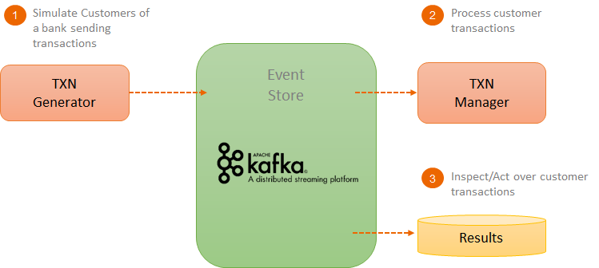
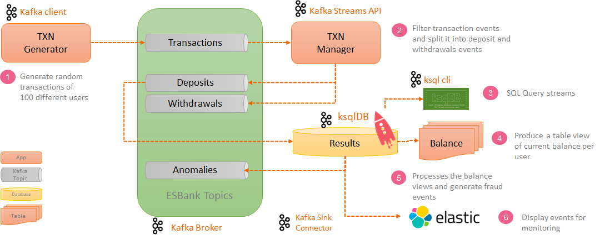

# ESBank
Event Streaming Bank

This is an fictional banking system application to demonstrate event streaming architecture using Apache kafka with kafka Streams API.
For more details about Kafka Streams API check the official documentation on [kafka.apache.org!](http://kafka.apache.org).

# Application overview
Bellow is the diagram the represents the initial implementation of the ESBank solution.
This is the simplified vision of the initial application architecture.

# Detailed Components Overview
This diagram presents the initial approach for starting the project with just on client (for generate transaction messages) and two processors (one for filtering using Kafka Streams API and other for creating new views using ksqlDB), additionally I started building a monitor using Kafka Connect embbed into ksqlDB to export data to Elasticsearch. 

The main idea is to starting from this point to reach the state where we can implement all the main components described bellow.

# Main components

**CLIENTS** - Represent the users of the ESBank in order to execute transactions

**CONNECTORS** - They bridge the gaps between clients and the core banking components, they create a secure abstraction to protect and easy integrate all kind of clients.

**PROCESSORS** - They are the core bank components that manage all transactions and actions

**MONITORS** - Monitor any kind of event

[clients] -> [connectors] -> [-- Processors --] <- [connectors] <- [monitors]

### ESBank Clients (Apps)

- ESBank Transaction Generator - Command line client for generate random bank transactions

- ESBank Internet Banking - Web client using React - **future**

### ESBank Connectors (API)

- ESBank Monitor Connector - Elasticsearch Kafka Connect

- ESBank Client Connector - Custom REST API using Java/Quarkus - **future**

### ESBank Processors (Core)

- ESBank Event Store - Apache Kafka Broker components
- ESBank Transaction Manager - Spring Cloud Stream App using Kafka Streams
- ESBank Fraud Detector - KSQLdb Table

### ESBank Monitors (Dashboard)

- ESBank Transaction Dashboard - Elasticsearch + Kibana

## Topics

- transactions
- deposits
- withdrawals
- anomalies

## Requirements

- Docker

### Commands
[Reference of commands used in this demo](COMMAND.md)